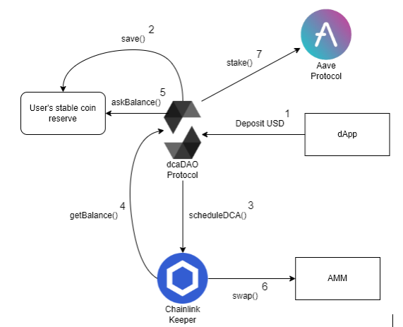

# Master project
This project is a decentralized dollar-cost averaging solution for the Ethereum cryptocurrency on the ethereum blockchain, dollar-cost averaging (DCA) is an investment strategy in which an investor divides up the total amount to be invested across periodic purchases of a target asset in an effort to reduce the impact of volatility on the overall purchase

# Repositories
- [smart-contracts](https://github.com/dca-dao/smart-contracts) : Smart contracts for our application, a smart contract is a self-executing contract written into lines of code, this can be considered as our backend, these [contracts](https://louper-mark3labs-pro.vercel.app/?address=0xe76B1F8e12d6491639c798B58De0b49F9b3b6ce2&network=kovan) are deployed on the kovan test network for ethereum
- [frontend](https://github.com/dca-dao/frontend) : Web interface repository, hosted [here](https://dapp-dca.netlify.app/) 
- [brownie_lottery_tuto](https://github.com/dca-dao/brownie_lottery_tuto) & [token-farm-dapp](https://github.com/dca-dao/token-farm-dapp) : Tutorials we learned from and trained on

# Stack
## Project
- Smart contracts : [Solidity](https://github.com/ethereum/solidity) (GPL 3.0 licence) language with the [brownie](https://github.com/eth-brownie/brownie) (MIT licence) library (python)
- Frontend : [Typescript](https://github.com/microsoft/TypeScript) (GPL 2.0 licence) language with [React](https://github.com/facebook/react) (MIT licence), it's using the [Metamask](https://metamask.io/download/) browser extension to interact with users wallets
## Architecture
- Smart contracts : We followed the [diamond pattern](https://eips.ethereum.org/EIPS/eip-2535#simple-summary) for our smart contracts, which is a standard for creating modular smart contracts that can be extended after deployment
- Frontend : React components
## Devops
- Workflow : [Gitflow](https://www.atlassian.com/fr/git/tutorials/comparing-workflows/gitflow-workflow)
- Smart contracts : CI on [CircleCI](https://app.circleci.com/pipelines/gh/dca-dao/smart-contracts) with a custom [docker image](https://hub.docker.com/repository/docker/pfontain/cci-dca-browie)
- Frontend : CI with github actions, test coverage report on [codecov](https://about.codecov.io/), deployed on netlify
## Tests
- Smart contracts : Python unit tests with pytests on Ethereum mainnet fork
- Frontend : Tests with react testing library, test coverage on [codecov](https://about.codecov.io/) 
## UX/UI
- Frontend : Material-ui components, simple UI

# Hosted

## Smart contract
[Diamond Louper](https://louper-mark3labs-pro.vercel.app/?address=0xe76B1F8e12d6491639c798B58De0b49F9b3b6ce2&network=kovan) 

DcaDiamond : [0x4e551ab784a1acDDE29eb4A5C4c6275d8fA4D52D](https://kovan.etherscan.io/address/0x4e551ab784a1acDDE29eb4A5C4c6275d8fA4D52D) \
DiamondCutFacet : [0xb3c6EF2BC56De7A14f29De34399fBDBFF25eBEB4](https://kovan.etherscan.io/address/0xb3c6EF2BC56De7A14f29De34399fBDBFF25eBEB4) \
DiamondLoupeFacet : [0x029943bE770a657EE81dbDc36beB86937565092C](https://kovan.etherscan.io/address/0x029943bE770a657EE81dbDc36beB86937565092C) \
OwnershipFacet : [0x96fB440Cd507D741BA852c34B15FF9Cb4e395B15](https://kovan.etherscan.io/address/0x96fB440Cd507D741BA852c34B15FF9Cb4e395B15) \
DcaManagerFacet : [0x0aD9E091755fE045ab0Aaf4da1925Ce68AE7F9e6](https://kovan.etherscan.io/address/0x0aD9E091755fE045ab0Aaf4da1925Ce68AE7F9e6) \
DcaKeeperFacer : [0xeD40A5D893DA6F2fE080A07770f132B969Ff2285](https://kovan.etherscan.io/address/0xeD40A5D893DA6F2fE080A07770f132B969Ff2285)

[Keeper](https://keepers.chain.link/kovan/3483) \
[Keeper Test](https://keepers.chain.link/kovan/3463)

## Front-end
[Dca App](https://dapp-dca.netlify.app/)

# Installation tutorial (Fedora Workstation 36)
## Setup
```console
sudo dnf install git
curl https://raw.githubusercontent.com/creationix/nvm/master/install.sh | bash 
source ~/.bashrc 
nvm install v16.15.1
curl --silent --location https://dl.yarnpkg.com/rpm/yarn.repo | sudo tee /etc/yum.repos.d/yarn.repo
sudo rpm --import https://dl.yarnpkg.com/rpm/pubkey.gpg
sudo dnf install yarn
mkdir dca
cd dca
git clone https://github.com/dca-dao/frontend.git
cd frontend/
yarn install
yarn start
```
This will use the hosted contracts, there is no need to deploy them locally
## Adding Metamask to Firefox (default browser on Fedora Workstation 36)
- Download [Metamask](https://addons.mozilla.org/fr/firefox/addon/ether-metamask/)
- Click on `Get Started`
- Click on `Import a wallet`
- Paste the 12 words : `hire tone slim pig endorse race pumpkin kangaroo beach promote hole bottom`, it will give you access to a wallet with testnet assets
- Setup a password
- Click import
## Change network on Metamask
- Click on `Ethereum Mainnet` in the top right corner
- Click on `Show/hide` test networks
- Show test networks : `ON`
- Choose Kovan Test Network
## On the DCA page
- Click connect
- Choose your account
- You have access to the app !

# How to setup a DCA
- Go to the DCA page and connect
- Make sure that you have enough ETH to pay for gas
- First, you need to approve the DAI contract and fund your acount with DAI, this will be used as a reserve
- Then you need to setup the amount and frequency of your DCA, this will take the amount in DAI and swap it for ETH
- Finally you can access the total value of your purchases and withdraw the amount

# Graphs and images
Images display [here](https://github.com/dca-dao/.github/blob/master/profile/README.md)  



